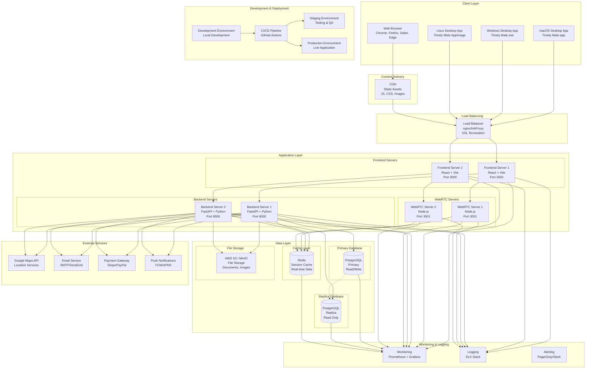

# Timely Mate - Deployment Architecture Diagram

## Overview
This document outlines the deployment architecture for Timely Mate, a comprehensive employee management and time tracking application available as both a web application and desktop application (Electron).

## Deployment Diagram

## Architecture Components

### 1. Client Layer
- **Web Browser**: Standard web application accessible via HTTPS
- **Desktop Applications**: 
  - macOS: `.app` bundle (Intel x64 + Apple Silicon ARM64)
  - Windows: `.exe` installer with NSIS
  - Linux: `.AppImage` portable executable

### 2. Content Delivery Network (CDN)
- Serves static assets (JS, CSS, images)
- Reduces server load and improves global performance
- Caches frequently accessed resources

### 3. Load Balancing
- Distributes incoming requests across multiple frontend servers
- Handles SSL termination
- Provides high availability and fault tolerance

### 4. Application Layer

#### Frontend Servers
- **Technology**: React + Vite + TypeScript
- **Features**: 
  - Time tracking and attendance management
  - Project and task management
  - HR and employee management
  - Real-time chat and video conferencing
  - Expense tracking and invoicing
  - Learning portal and document management

#### Backend Servers
- **Technology**: FastAPI + Python
- **Features**:
  - RESTful API endpoints
  - Authentication and authorization
  - Business logic processing
  - Data validation and serialization

#### WebRTC Servers
- **Technology**: Node.js + Socket.IO
- **Features**:
  - Real-time video conferencing
  - Live chat functionality
  - Screen sharing capabilities
  - File sharing during meetings

### 5. Data Layer

#### Database
- **Primary Database**: PostgreSQL (Read/Write operations)
- **Replica Database**: PostgreSQL (Read-only operations for reporting)
- **Features**: ACID compliance, JSON support, full-text search

#### Cache Layer
- **Redis**: Session management, real-time data caching
- **Features**: High-performance in-memory storage

#### File Storage
- **AWS S3 / MinIO**: Document and image storage
- **Features**: Scalable object storage, CDN integration

### 6. External Services
- **Google Maps API**: Location services for offsite work tracking
- **Email Service**: SMTP/SendGrid for notifications and communications
- **Payment Gateway**: Stripe/PayPal for subscription management
- **Push Notifications**: FCM/APNS for mobile and desktop notifications

### 7. Monitoring & Logging
- **Monitoring**: Prometheus + Grafana for metrics and dashboards
- **Logging**: ELK Stack (Elasticsearch, Logstash, Kibana)
- **Alerting**: PagerDuty/Slack integration for incident management

### 8. Development & Deployment
- **Development**: Local development environment with hot reload
- **CI/CD**: GitHub Actions for automated testing and deployment
- **Staging**: Pre-production environment for testing
- **Production**: Live application environment

## Deployment Environments

### Development Environment
- Local development with `npm run dev`
- Hot reload enabled
- Mock data and services
- Development database

### Staging Environment
- Production-like environment
- Real external service integrations
- Performance testing
- User acceptance testing

### Production Environment
- High availability setup
- Load balancing
- Database replication
- Monitoring and alerting
- SSL/TLS encryption

## Security Considerations

### Application Security
- Content Security Policy (CSP) headers
- Input validation and sanitization
- SQL injection prevention
- XSS protection
- CSRF tokens

### Infrastructure Security
- SSL/TLS encryption in transit
- Database encryption at rest
- Network segmentation
- Firewall rules
- Regular security updates

### Desktop Application Security
- Code signing for macOS and Windows
- Electron security best practices
- Context isolation enabled
- Node integration disabled
- Secure preload scripts

## Scalability Features

### Horizontal Scaling
- Multiple frontend and backend servers
- Load balancer distribution
- Database read replicas
- CDN for static assets

### Performance Optimization
- Redis caching
- Database query optimization
- Image compression and optimization
- Lazy loading and code splitting
- Service worker for offline functionality

## Backup and Disaster Recovery

### Data Backup
- Automated database backups
- File storage replication
- Cross-region backup storage
- Point-in-time recovery

### Disaster Recovery
- Multi-region deployment
- Automated failover
- Data replication
- Recovery time objectives (RTO) and recovery point objectives (RPO)

## License Management

### Desktop Applications
- First-launch license activation
- Online/offline license validation
- Trial period management
- License key storage and verification

### Web Application
- Subscription-based access
- Feature-based licensing
- User role management
- Usage tracking and analytics

